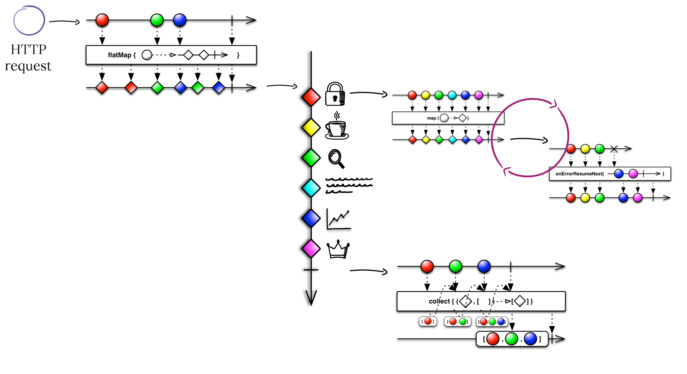

# Fragments Handler
It is a **Handler** that processes a request during HTTP Server request processing.
It operates on **Fragments** that are result of breaking request into smaller, independent parts. 

## How does it works

Each Fragment may specify a processing Task that defines a graph of Actions.

Each Action transforms content of Fragment or updates Fragment's payload. 

Fragment's path in the Task graph is defined by Action's output, called Transition.

Actions is a simple function (business logic) with some restrictions imposed. E.g. function processing
time can be limited to a certain amount of time. If it will not end in that time (Action timeout), 
error Transition is returned and some fallback Action may be applied.

The diagram belows depicts Fragments Engine logic (map-reduce).

## Licence
**Knot.x Fragments Handler** is licensed under the [Apache License, Version 2.0 (the "License")](https://www.apache.org/licenses/LICENSE-2.0.txt)

Icons comes from [https://www.slidescarnival.com](https://www.slidescarnival.com/copyright-and-legal-information#license) and 
use [Creative Commons License Attribution 4.0 International](https://creativecommons.org/licenses/by/4.0/) License.