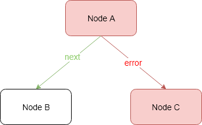

# Fragments Engine

// TODO documentation

## Graph Engine

Each *Fragment* defines its own processing path, which is configured as a **directed graph**. A graph
specify the nodes (vertices) through which Fragments will be routed by Graph Engine. Each node 
contains fragment transformation logic and possible *arrows* / *outgoing edges* (then called *transitions*). 
Fragment transformation logic is defines as a function 
`java.util.function.Function<FragmentContext, Single<FragmentResult>>`. It transforms one Fragment 
into another.

By default, each node has two exits:
- `next` - the default one, means that operation ends without any exception
- `error` - when operation throws an exception

If a node does not declare a `next` transition, processing is finished and Graph Engine responds with
`SUCCESS` status.

Let's see the example above. *Node A* declares two transitions: next and error. If the transformation 
logic defined in *Node A* ends correctly, then the `next` transition is set (if *Node A* does
not set a custom transition) and *Node B* will continue processing.
If *Node B* ends correctly then Graph Engine responds with the `SUCCESS` status. Otherwise, the `error` 
transition is set, *Node B* does not declare it so the `FAILURE` state is returned.
If the transformation logic from *Node A* raises an exception, the `error` transition is set and
*Node C* continue processing. *Node C* may end correctly, and then the entire processing is marked 
with the `SUCCESS` state.

The images below illustrates the above rules.

`SUCCESS` states:

* *Node A* and *Node B* ends correctly:

* *Node A* raises an exception, *Node B* ends correctly 

`FAILURE` states:

* *Node A* ends correctly and *Node B* raises exception:

* *Node A* and *Node C* raises exceptions:

A node can also declare its own exits (transitions) but then we need to configure them in a graph. 
Otherwise, if the custom transition is set but is not declared, then the `FAILURE` status is returned:

