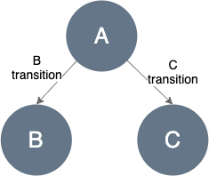
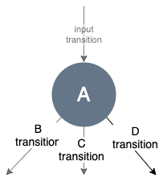
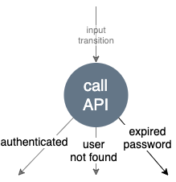
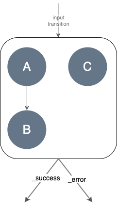
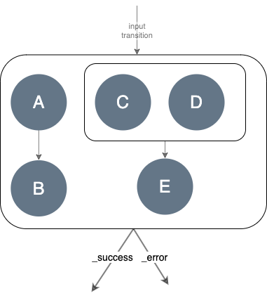
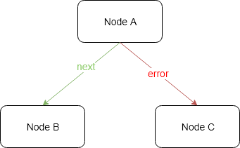
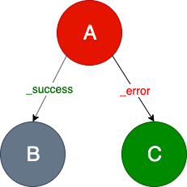
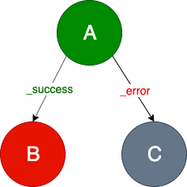
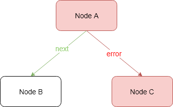
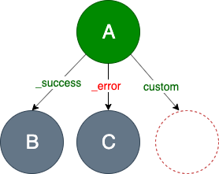

# Fragments Engine
Fragments Engine is a framework that transforms a business logic into a graph, that can be easily adjusted to the changes in the future. 

## How does it work
Fragments Engine accepts a list of fragments decorated with the incoming HTTP request data. Each 
[Fragment](https://github.com/Knotx/knotx-fragments/tree/master/api#fragment) defines its own 
business logic in the form of a [Task](#task). The task is a graph (speaking strictly 
a [DAG - Directed Acyclic Graph](https://en.wikipedia.org/wiki/Directed_acyclic_graph_), composed of steps ([Nodes](#node)) 
that are connected with business decisions ([Transitions](#transition)).

It applies tasks to fragments asynchronously.

Finally, we get a list of modified fragments that contain [fragments' statuses](#fragments-status) 
and [processing logs](#fragments-log). 

## Task
Task decomposes business logic into lightweight dependent parts. Those parts are graph nodes 
connected by transitions. So a task is a directed graph of nodes. Nodes define an operation on the 
fragment (some business logic), whereas transitions draw business decisions.
This graph is acyclic and each of its nodes can be reached only from exactly one path (transition). 
These properties enable us to treat the Task as a tree structure.

The graph above depicts nodes, represented by circles (`A, B, C`), and transitions illustrated as 
arrows (`B transition`, `C transition`).

Tasks allow defining more complex structures such as a list of subtasks (subgraphs).

### Node
Node has a single input and declares zero-to-many outputs (transitions). Node outputs (transitions) 
indicate business decisions, whereas node logic can modify a fragment.

#### Single Node
A node represents a [fragment operation](https://github.com/Knotx/knotx-fragments/tree/master/api#fragment-operation) 
that performs business logic operations (see [Fragment Operation](https://github.com/Knotx/knotx-fragments/tree/master/api#fragment-operation) for more details).

The diagram below represents the single node (A) with three outputs: `B transition`, `C transition`, 
`D transition`.

The example of this node is calling an authentication RESTful API. The node implements a communication 
logic and reacts to different API responses such as  HTTP 200/401/404 status codes.

Each status code may represent various decisions such as a successful authentication, a user not 
found or even expired password.
 
#### Composite Node
Composite node defines a list of subgraphs to evaluate. It enables `parallel` processing of independent 
nodes/subgraphs (e.g. calling two external independent data sources).

A composite node can respond with only two transitions:
  - `_success` - the default one, means that operation ends without any exception
  - `_error` - when operation throws an exception

It may consist of list of subgraphs of single nodes:

or other composite nodes (or a mix of both).

The diagram above represents a composite node that consists of: 
- subgraph starting with `A` node
- subgraph that is also a composite node (that consists of two subgraphs starting with `C` and `D` nodes).
  
> Important note!
> Nodes inside the composite node may only modify the Fragment's payload and should not modify 
> the Fragment's body.

### Node log
Every node can prepare some data that describes what happened during its processing. It is a JSON 
structure, called a node log. The node log syntax depends on node implementation.

## Transition
A directed graph consists of nodes and edges. Edges are called transitions. Transition is identified by a string. 

The pre-defined transitions are:
- `_success` - the default one, indicates that operation completes successfully (no exception)
- `_error` - means that operation has throw an exception

There are two important rules to remember:
> If a node responds with *_success* transition, but the `_success` transition is not configured, then 
>processing of the graph/subgraph is finished.

> If a node responds with *_error* transition, but the `_error` transition is not configured, then an 
>exception is returned.

> If a node responds with a not configured transition, the "Unsupported Transition" error occurs.

Nodes can declare custom transitions. Custom transitions allow to react to non standard situations 
such as data sources timeouts, fallbacks etc.

## Fragment's status
During fragment's processing, a fragment's status is calculated. Each node responds with a transition. 
Fragments Engine validates node responses and set one of the fragment's statuses:
- `unprocessed`
- `success`
- `failure`

The engine accepts a list of fragments to process and responds with a list of processed fragments 
containing fragment's data, the processing status and log. The decision what should happen when some 
fragment's statuses are `failure` is not taken in the engine.

Let's see the example below to understand when the fragment's status is `success` or `failure`.

> The *A* node declares two transitions: `_success` and `_error`. If the processing of the *A* node 
>finishes correctly, it responds with the `_success` transition and then the *B* node will continue 
>processing.

> If the `B` node completes successfully, it ends fragment processing with the `SUCCESS` status. 
> Otherwise, it returns the  `_error` transition and the fragment's status is `FAILURE`.

> If the processing of the `A` node throws an exception, then the `_error` transition is set, and 
>the `C` node continues processing. 

The images below illustrates the above rules.

`SUCCESS` statuses:

* `A` and `B` ends correctly

* `A` raises an exception (or responds with `_error`), then `B` ends correctly 

`FAILURE` status:

* `A` ends correctly, however `B` raises an exception (or responds with `_error`)

* `A` and `C` raise exceptions (or respond with `_error`)

* `A` node can also respond with its custom transitions. Then we have to configure them in a graph. 
Otherwise, if the `custom` transition is set but is not declared, then the `FAILURE` status is returned

## Fragment's log
A fragment's log contains details about task evaluation. When node processing ends (or 
raises an exception), the engine appends the new [entry](https://github.com/Knotx/knotx-fragments/blob/master/engine/src/main/java/io/knotx/fragments/engine/EventLogEntry.java) 
in the fragment's log containing:
- task name
- node identifier
- node status
- [node log](#node-log)
- transition
- timestamp.

Node status is a simple text value managed by the engine. It resembles a fragment's status but is a 
bit more accurate (such as a `UNSUPPORTED_TRANSITION` value).

Let's see an example fragment's log. There is a fragment that defines a task named `taskName`. The 
task is a graph of two nodes: `A` and `B`.

The `A` node responds with the `_success` transition. Then the `B` node starts processing and responds 
with the `_succcess` transition. Finally, the fragment status is `SUCCESS` and the fragment's log contains:

| Task       | Node identifier | Node status | Transition | Node Log        |
|------------|-----------------|-------------|------------|-----------------|
| `taskName` | `A`             | SUCCESS     | `_success` | { A node log }  |
| `taskName` | `B`             | SUCCESS     | `_success` | { B node log }  |
