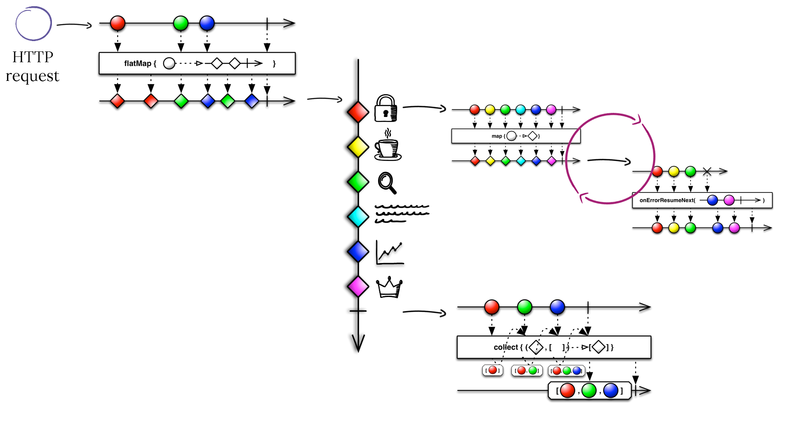

# Fragments Handler
It is a [**Handler**](https://github.com/Knotx/knotx-server-http/tree/master/api#routing-handlers)
that [evaluates Fragments](https://github.com/Knotx/knotx-fragments#evaluate-fragments). It is 
a standard [HTTP Server routing handler](https://github.com/Knotx/knotx-server-http/blob/master/README.md#routing-handler).

## How does it work
Fragments handler evaluates all fragments independently in a map-reduce fashion. It delegates fragment 
processing to the [Fragment Engine](https://github.com/Knotx/knotx-fragments/tree/master/handler/engine).  
The engine checks if the fragment requires processing and if it does then fragment processing starts.
Order and transitions between each of these executions is represented as a directed acyclic graph 
(DAG). A single graph is called a `Task`.

The diagram below depicts the map-reduce logic using [Marble Diagrams for Reactive Streams](https://medium.com/@jshvarts/read-marble-diagrams-like-a-pro-3d72934d3ef5):



Let's assume that Knot.x gets HTTP requests for data coming from many different sources. Dots at the 
`flatMap` diagram represents incoming requests. For simplicity assume that each request maps to a 
single fragment to process. Then each fragment is evaluated in isolation, not waiting for others. 
A fragment defines a task (graph) describing how to fetch the required data. The `map` and 
`onErrorResumeNext` diagrams represent a graph processing. When the fragment processing finishes, the 
modified fragment is returned. Please note that an HTTP request can be mapped to many fragments. In 
such a case the `collect` diagram represents fragments joining.

Read more about the benefits [here](http://knotx.io/blog/configurable-integrations/).

## How to configure
For all configuration fields and their defaults consult [FragmentsHandlerOptions](https://github.com/Knotx/knotx-fragments/blob/master/handler/core/docs/asciidoc/dataobjects.adoc#fragmentshandleroptions).

In general:
- it gets fragments from a request, collects only those that require processing checking fragment's 
configuration `taskNameKey` key
- it finds [task](https://github.com/Knotx/knotx-fragments/tree/master/handler/engine#task) factory 
from `taskFactories` that can create a task
- task factory constructs a task (DAG - directed acyclic graph)
- [Fragment Engine](https://github.com/Knotx/knotx-fragments/tree/master/handler/engine) continues 
further fragment's processing

Detailed description of each configuration option is described in the next subsection.

### TaskFactoryOptions
The `taskFactories` is an array of [TaskFactoryOptions](https://github.com/Knotx/knotx-fragments/blob/feature/%2349-node-factories-with-common-configs/handler/core/docs/asciidoc/dataobjects.adoc#taskfactoryoptions) 
that contains configs for registered [task factories](https://github.com/Knotx/knotx-fragments/blob/master/handler/core/src/main/java/io/knotx/fragments/task/TaskFactory.java) 
implementations.

All task factory implementations are registered using a simple service-provider loading facility - 
[Service Loader](https://docs.oracle.com/javase/8/docs/api/java/util/ServiceLoader.html).

# Default task factory
It is the default task factory containing a list of supported tasks' names with their definition. A 
definition represents a directed acyclic graph (DAG).  
It introduces its custom graph nodes
- [action](#action-node)
- [subtasks](#subtasks-node)

## How does it work
Task factory creates a task based on its configuration. It registers graph node factories, delegates 
node initialization to them and joins all nodes with transitions. 

The task is an [identifiable graph](https://github.com/Knotx/knotx-fragments/blob/master/handler/engine/src/main/java/io/knotx/fragments/engine/Task.java) 
that describes the way fragment should be processed. It is a part of Fragment Engine's API.

## How to configure
For all configuration fields and their defaults consult [DefaultTaskFactoryConfig](https://github.com/Knotx/knotx-fragments/blob/master/handler/core/docs/asciidoc/dataobjects.adoc#defaulttaskfactoryconfig).

In general:
- it defines supported tasks (by name) containing graph configuration in `tasks`
- a graph configuration is converted to task with node factories defined in `nodeFactories`

### Tasks
[Tasks](https://github.com/Knotx/knotx-fragments/tree/master/handler/engine#task) are configured in 
the form of a dictionary (`taskName -> graph logic`):
```hocon
tasks {
  # unique task name
  myTask { 
    # graph configuration
  }
}
```

A graph configuration starts with a root [node](#nodes) definition. Each node sets some logic to perform over a fragment 
 and outgoing edges (called [transitions](#transition)). So there are two sections:
```hocon
node {
  # node options (fragment processing logic)
}
onTransitions {
  # node outgoing edges
}
```

#### Node
Node is described [here](https://github.com/Knotx/knotx-fragments/tree/master/handler/engine#node).
Each task provider can provide its custom nodes.

The default task provider allows registering node factories that are used during the graph 
configuration. So each node defines its custom factory and options:
```hocon
node {
  factory = factory-name
  config {
    # node options
  }
}
```

The `factory` parameter specifies a node factory name, `config` contains all configs passed to 
the factory.

All custom node types that are finally converted to the 
[generic node types](https://github.com/Knotx/knotx-fragments/tree/master/handler/engine#node-types).

#### Transition
A directed graph consists of nodes and edges. Edges are called 
[transitions](https://github.com/Knotx/knotx-fragments/tree/master/handler/engine#transition). 

Their configuration looks like:
```hocon
onTransitions {
  _success {
    # next node when _success transition
  }
  _error {
    # next node when error occurs
  }
  customTransition {
    # next node when custom transition
  }
}
```

### Node factories
The `nodeFactories` is an array of [NodeFactoryOptions](https://github.com/Knotx/knotx-fragments/blob/master/handler/core/docs/asciidoc/dataobjects.adoc#nodefactoryoptions) 
that contains configs for registered [node factories](https://github.com/Knotx/knotx-fragments/blob/master/handler/core/src/main/java/io/knotx/fragments/task/factory/node/NodeFactory.java) 
implementations.

All node factory implementations are registered using a simple service-provider loading facility - 
[Service Loader](https://docs.oracle.com/javase/8/docs/api/java/util/ServiceLoader.html).

#### Action node factory
It is implemented by the [ActionNodeFactory](https://github.com/Knotx/knotx-fragments/blob/master/handler/core/src/main/java/io/knotx/fragments/task/factory/node/action/ActionNodeFactory.java) 
class. Its name is `action`. It is configured with [ActionNodeFactoryConfig](https://github.com/Knotx/knotx-fragments/blob/master/handler/core/docs/asciidoc/dataobjects.adoc#actionnodefactoryconfig).

In general:
- it declares [actions](#actions) that are used in action node declarations
- global node log level that is passed to actions

##### Action node declaration
An action node factory creates action nodes. An *action node* declares an [action](#actions) to 
execute by its name:
```hocon
node {
  factory = action
  config {
    action = reference-to-action
    # onTransitions { }
  }
}
```
The above example specifies the action node that delegates processing to the `reference-to-action` 
action and has no transitions.

The default task factory allows simplifying action nodes declaration with the following syntax sugar:
```hocon
action = reference-to-action
# onTransitions { }
```

##### Logs
Action node appends a single [fragment's log](https://github.com/Knotx/knotx-fragments/tree/master/handler/engine#fragments-log) 
entry:

| Task       | Node identifier       | Node status | Transition | Node Log        |
|------------|-----------------------|-------------|------------|-----------------|
| `taskName` | `reference-to-action` | SUCCESS     | `_success` |  { }            |

with the custom [node log](https://github.com/Knotx/knotx-fragments/tree/master/handler/engine#node-log) syntax.

Let's assume that `NODE_LOG` is an action's node log. The node log has the syntax:
```json5
{
  _alias: "reference-to-action",
  _logs: { 
    // action log goes here
  },
  _doAction: [
    // NODE_LOG, NODE_LOG, ...
  ]
}
```
So it supports both [actions](#actions) and [behaviours](#behaviours). Actions deliver their custom 
[logger](https://github.com/Knotx/knotx-fragments/blob/feature/%2347-action-log-structure/handler/api/src/main/java/io/knotx/fragments/handler/api/actionlog/ActionLogBuilder.java) 
implementation that hides syntax complexity.

#### Subtasks node factory
A subtask is nothing else than a subgraph defined inside the task.
Creating subtasks is implemented in the [SubtasksNodeFactory](https://github.com/Knotx/knotx-fragments/blob/master/handler/core/src/main/java/io/knotx/fragments/task/factory/node/subtasks/SubtasksNodeFactory.java) 
class. Its name is `subtasks`. Its configuration is empty. 

##### Subtasks node declaration
Subtasks node is a node containing a list of subtasks. It evaluates all of them sequentially. 
However, all the operations are non-blocking, so it doesn't wait for previous subtasks to finish. 
Because of that, they are effectively executed in parallel

Moreover, a list of subtasks must fit the `F -> (F',T)` function. Each subtask has its fragment 
context, execute it's logic and update the fragment's payload (its own copy). Finally, when all
subtasks are completed, all payloads are merged and the new Fragment is returned.

> Note that [body](https://github.com/Knotx/knotx-fragments/blob/master/api/src/main/java/io/knotx/fragments/api/Fragment.java) modifications are not allowed because of the parallel execution of subtask nodes and the final `body` form cannot be determined. However, updating the fragment's `payload` is fine since all subtask nodes have their unique namespaces.

A subtask node definition is:
```hocon
node {
  factory = subtasks
  config {
    subtasks = [
      { 
        # subtask rootNodeDefinition
      },
      ...
    ]
  }
}
```
It follows the same simplification rules as action nodes:
```hocon
subtasks = [
  { 
    # subtask rootNodeDefinition
  },
  ...
]
```
Please note that `subtasks` is a list of nodes.

Let's see the example:
```hocon
subtasks = [
  { 
    action = book-rest-api
    # onTransitions { }
  },
  { 
    action = author-rest-api
    # onTransitions {}
  }
]
```
In the example above, the `book-rest-api` and `author-rest-api` actions are executed in parallel as 
two independent tasks (graphs) with one node (action).

See the [example section](#the-example) for a more complex scenario. Before we see the full 
power of graphs, we need to understand how nodes are connected.

##### Logs
Subtasks node appends a single [fragment's log](https://github.com/Knotx/knotx-fragments/tree/master/handler/engine#fragments-log) 
entry when all subgraphs are processed:

| Task       | Node identifier | Node status | Transition | Node Log        |
|------------|-----------------|-------------|------------|-----------------|
| `taskName` | `composite`     | SUCCESS     | `_success` |                 |

Please note that the node log is empty.

### Example
The example below collects data about the book and its authors from external APIs. Book and authors 
APIs accept ISBN and respond with JSON. We can invoke those APIs in parallel.
However, the book API does not contain the score. There is a separate service that accepts secret 
token from the book API and exposes the score data with XML syntax. When no secret token is found, 
then it responds with an empty score. 

The above logic can be easily transformed into the task:
```hocon
tasks {
  book-and-author-task {
    config {
      actions {
        book-rest-api {}
        author-rest-api {}
        book-from-cache{}
        score-api {}
        score-estimation {}
      }
    }
    subtasks = [
      { # 1st subtask
        action = book-rest-api # HTTP Action
        onTransitions {
          _success {
            action = score-api # custom action
            onTransitions {
              noScore { # custom transition
                action = score-estimation # custom action
                # _success {} - subtask finished
              }
              # _success {} - subtask finished
            }   
          }
          _error {
            action = book-from-cache # custom action
          } 
        }
      },
      { # 2nd subtask
        action = author-rest-api # HTTP Action
        # _success {} - subtask finished
      }
    ]
    onTransitions {
      _error {
        action = book-and-author-fallback
      }
    }
  # END subtasks
  }
}
```
The task root node is the subtasks node that declares two subtasks:
```hocon
action = book-rest-api
onTransitions {
  _success {
    action = score-api
    onTransitions {
      noScore {
        action = score-estimation
      }
    }   
  }
  _error {
    action = book-from-cache
  } 
}
```
and
```hocon
action = author-rest-api
```
Those subtasks are executed in parallel because there is no dependency between them. If any of them 
fails then the `book-and-author-fallback` fallback action is applied.
We used a similar strategy for the book API invocation. In this declarative way, we can easily handle 
timeouts and errors from APIs.
Please note that no error strategy has been defined for authors API yet. However, it can be easily 
configured in the future when business agrees on the fallback logic.

# Actions
Action is a simple function that converts a fragment to the new one and responds with the
[transition](#transition). Its contract is the same as the
[node](https://github.com/Knotx/knotx-fragments/tree/master/handler/engine#node)'s one. So an 
action defines a fragment's processing logic. Actions implement the 
[Action](https://github.com/Knotx/knotx-fragments/blob/master/handler/api/src/main/java/io/knotx/fragments/handler/api/Action.java) 
interface.

Action can integrate with external data sources, do some fragments modifications or even 
update some database records. 
They can update a fragment, change all fragment's payload values. However, they should 
store their data in the payload (JSON object) under the action's name key.

Actions can have some [behaviours](#behaviours). Those behaviours come with some functionality, 
such as caching, however, they are not specific for particular action implementation.

## Action factory
All actions provide [factories](https://github.com/Knotx/knotx-fragments/blob/master/handler/api/src/main/java/io/knotx/fragments/handler/api/ActionFactory.java) 
that are registered using a simple service-provider loading facility - 
[Service Loader](https://docs.oracle.com/javase/8/docs/api/java/util/ServiceLoader.html).

For all configuration fields and their defaults consult [ActionFactoryOptions](https://github.com/Knotx/knotx-fragments/blob/master/handler/core/docs/asciidoc/dataobjects.adoc#actionfactoryoptions).

## Action's types

### HTTP Action
The HTTP Action fetches JSON data from REST APIs (GET request). See more 
[here](https://github.com/Knotx/knotx-data-bridge/tree/master/http).

### Inline Body Action
Inline Body Action replaces Fragment body with specified one. Its configuration looks like:
```hocon
factory = "inline-body"
config {
  body = <div>Product not available at the moment</div>
}

```
The default `body` value is empty content.

### Inline Payload Action
Inline Payload Action puts JSON / JSON Array in Fragment payload with a specified key (alias). Its 
configuration looks like:
```hocon
factory = "inline-payload"
config {
  alias = product
  payload {
    productId = 1234
    description = "some description"
  }
  # payload = [
  #   "first product", "second product"
  # ]
}
```
The default `alias` is action alias.

### Payload To Body Action
Payload To Body Action copies to Fragment body specified payload key value. Its configuration looks like:
```hocon
factory = payload-to-body
config {
  key = "some payload key"
}
```
If no key is specified the whole payload will be copied. A key can direct nested values. For example 
for the payload:
```hocon
someKey {
  someNestedKey {
    attr1 = value1
    attr2 = value2 
  }
}
```
and key value `someKey.someNestedKey` body value will look like:
```hocon
{ 
  attr1 = value1
  attr2 = value2 
}
```

## Behaviours
Behaviours wrap other behaviours or [actions](#actions) and delegate a fragment processing to them. 
They can introduce some stability patterns such as retires, it means that they can call a wrapped 
action many times.

### Circuit Breaker Behaviour
It wraps a simple action with the [Circuit Breaker implementation from Vert.x](https://vertx.io/docs/vertx-circuit-breaker/java/).
Its configuration looks like:
```hocon
factory = "cb"
config {
  circuitBreakerName = product-cb-name
  circuitBreakerOptions {
    # number of failure before opening the circuit
    maxFailures = 3
    # consider a failure if the operation does not succeed in time
    timeout = 2000
    # time spent in open state before attempting to re-try
    resetTimeout = 10000
  }
}
doAction = product
```
The `doAction` attribute specifies a wrapped simple action by its name. When `doAction` throws an error 
or times out then the custom `fallback` transition is returned.

### In-memory Cache Behaviour
It wraps a simple action with cache. It caches a payload values added by a `doAction` action and 
puts cached values in next invocations. It uses in-memory Guava cache implementation. The 
configuration looks like:
```hocon
factory = "in-memory-cache"
config {
  cache {
    maximumSize = 1000
    # in milliseconds
    ttl = 5000
  }
  cacheKey = "product-{param.id}"
  payloadKey = product
}
doAction = product-cb
```
Please note that cacheKey can be parametrized with request data like params, headers etc. Read 
[Knot.x HTTP Server Common Placeholders](https://github.com/Knotx/knotx-server-http/tree/master/common/placeholders)
documentation for more details.
