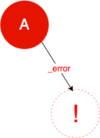
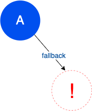
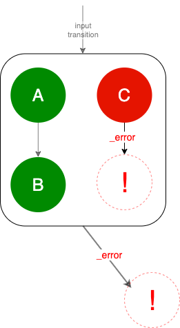
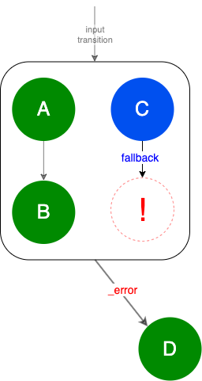
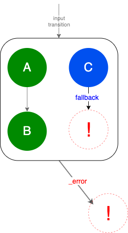
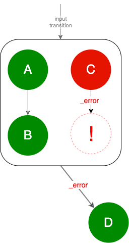

# Fragment HTML Body Writer
It wraps the beginning and the end of configured fragments with HTML comments and adds the `script` tag
with details of fragment processing:
```
<!-- data-knotx-id="FRAGMENT_IDENTIFIER" -->
  <script data-knotx-id="FRAGMENT_IDENTIFIER" type="application/json">
    FRAGMENT_EXECUTION_LOG
  </script>
  FRAGMENT_BODY
<!-- data-knotx-id="FRAGMENT_IDENTIFIER" -->
```
where:
  - `FRAGMENT_IDENTIFIER` is a unique identifier of a fragment, randomly generated value on the 
  HTTP request
  - `FRAGMENT_EXECUTION_LOG` is a JSON, which contains fragment processing details

`FRAGMENT_EXECUTION_LOG` is described [here](#what-processing-details-are-exposed).

## How to start?
- Configure consumer in handler
  - add a [consumer factory configuration](#how-to-configure) to the [Fragments Handler options](https://github.com/Knotx/knotx-fragments/blob/master/handler/core/docs/asciidoc/dataobjects.adoc#fragmentshandleroptions)
  - set `logLevel` to `INFO` for more fragments' processing details in the [Default Task Factory config](https://github.com/Knotx/knotx-fragments/blob/master/handler/core/docs/asciidoc/dataobjects.adoc#defaulttaskfactoryconfig)
- Visualize fragments with [Knot.x Fragments Chrome Extension](https://github.com/Knotx/knotx-fragments-chrome-extension) 
  or simply check the HTML markup
  
Any issues? Please check the [functional](https://github.com/Knotx/knotx-stack/blob/master/src/functionalTest/java/io/knotx/stack/functional/KnotxFragmentsDebugDataWithHandlebarsTest.java) test configuration.

## How to configure?
It must be configured in `consumerFactories`
```hocon
consumerFactories = [
  {
    factory = fragmentHtmlBodyWriter
    config { CONSUMER_CONFIG }
  }
]
```
where `CONSUMER_CONFIG` consists of:
```hocon
condition {
  param = debug
  # header = x-knotx-debug
}
fragmentTypes = [ "snippet" ]
```
It runs when any of the following conditions are met:
 - `param` - an original request contains a parameter with the *given name* (e.g. by configuring 
 `param=debug`, requesting `{address}?debug=true` will meet the condition),
 - `header` - condition is analogous, but the value comes from the request header.
 
If no condition is configured, the consumer is not triggered.

## What processing details are exposed?

[Fragment execution log](https://github.com/Knotx/knotx-fragments/blob/master/handler/consumer/html/docs/asciidoc/dataobjects.adoc#fragmentexecutionlog) (`FRAGMENT_EXECUTION_LOG`) 
is a JSON that contains both [fragment](https://github.com/Knotx/knotx-fragments/blob/master/api/docs/asciidoc/dataobjects.adoc#fragment) 
data and [graph node execution log](https://github.com/Knotx/knotx-fragments/blob/master/handler/consumer/html/docs/asciidoc/dataobjects.adoc#graphnodeexecutionlog).
  
The graph node execution log ([Task](https://github.com/Knotx/knotx-fragments/tree/master/engine#task) 
evaluation details) contains data about the processing of the root node and allows you to traverse 
the entire graph.

### Graph Node Execution Log
Graph node execution log represents a root node execution data. It combines knowledge from sources:
- [Task definition](https://github.com/Knotx/knotx-fragments/tree/master/engine#task)
- [Task metadata](https://github.com/Knotx/knotx-fragments/blob/master/handler/api/src/main/java/io/knotx/fragments/handler/api/metadata/TaskMetadata.java)
- [Fragment's log](https://github.com/Knotx/knotx-fragments/tree/master/engine#fragments-log)

#### Missing nodes
The main difference between a Task definition and graph node execution log are missing nodes.
When graph or subgraph processing ends with a [transition](https://github.com/Knotx/knotx-fragments/tree/master/engine#transition) 
other than `_success` then a missing node is added. 

See the scenarios below:
- [single node](https://github.com/Knotx/knotx-fragments/tree/master/engine#single-node) responds 
  with the `_error` transition that is not configured

  

- [single node](https://github.com/Knotx/knotx-fragments/tree/master/engine#single-node) responds 
  with the custom transition that is not configured
  
  
  
- one of the subgraphs in the [composite node](https://github.com/Knotx/knotx-fragments/tree/master/engine#composite-node) 
  ends with `_error` transition that is not configured as a node output

  

- one of the subgraphs in the [composite node](https://github.com/Knotx/knotx-fragments/tree/master/engine#composite-node) 
  ends with `_error` transition and the `_error` node output is configured 

  

- one of the subgraphs in the [composite node](https://github.com/Knotx/knotx-fragments/tree/master/engine#composite-node) 
  ends with a custom transition that is not configured as a node output

  

- one of the subgraphs in the [composite node](https://github.com/Knotx/knotx-fragments/tree/master/engine#composite-node) ends with custom `fallback` transition and `fallback` transition is configured for the composite node

  
  
Green nodes end with `_success` transition, red nodes with `_error` and blue nodes with custom. Nodes 
with exclamation mark are missing nodes. 
