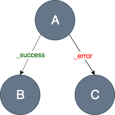
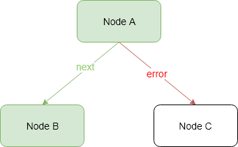
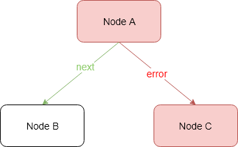
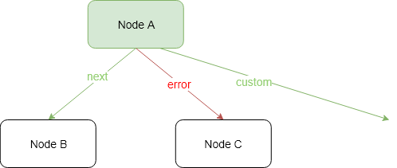

# Fragments Engine
Fragments Engine is a reactive asynchronous map-reduce implementation, enjoying the benefits of Reactive Extensions, 
that evaluates each Fragment independently using a `Task` definition. `Task` specifies a directed graph of Nodes, 
allowing to transform Fragment into the new one.
```
F -> F', T
```
- `F` - Fragment to transform
- `F'` - the modified Fragment
- `T` represents Transition, a text value, that defines the next Node from the graph

## How does it work
Any *Fragment* can define its processing path - a **Task** (which is a **directed graph** of **Nodes**).
A **Task** specifies the nodes through which Fragments will be routed by the Task Engine. 
Each Node may define possible *outgoing edges* - **Transitions**.

Additionally, a **Node** can do one of the following:
  - define a **single** [Action](https://github.com/Knotx/knotx-fragments/tree/master/handler/api#action)
  that will be applied to Fragment (called [Action Node](#action-node)),
  - define **many**/**parallel** Actions that are applied to Fragment (called [Composite Node](#composite-node)) .

### Action Node
Action that is applied on the node is a transformation function 
`java.util.function.Function<FragmentContext, Single<FragmentResult>>` that transforms one Fragment 
into another.

Part of the `FragmentResult` is a *Transition* that defines the next *Node* in the graph that the Fragment
should visit. If there is no transition defined, default `_success` value is used.
Action Node transformation may return any *Transition*, but all the transitions but `_success` must be
configured. If there is no **path** configured for the transition, the following logic is applied:
 - if the *Transition* equals `_success` (default value), graph processing finishes
 - otherwise "Unsupported Transition" error occurs.
 
### Composite Node
This Node may consist of other Composite Nodes or Action Nodes or a mix of both.
It enables parallel processing of independent Actions (e.g. calling two external data sources).
Composite Node may define only two transitions:
  - `_success` - the default one, means that operation ends without any exception
  - `_error` - when operation throws an exception
  
> Important note!
> Action Nodes inside the Composite Node may only modify the Fragment's payload and should not modify the Fragment's body.
> This is because Actions are executed in parallel and the output of modifying a single Fragment's body in parallel
> may differ between different executions.

## Node states



If a node does not declare a `_success` transition, processing is finished and Task Engine responds with
`SUCCESS` status.

Let's see the example above. *Node A* declares two transitions: `_success` and `_error`. 
If the transformation logic defined in *Node A* ends correctly, then the `_success` transition 
is set by default (unless *Node A* has set a custom transition) and *Node B* will continue processing.
If *Node B* ends correctly then Task Engine responds with the `SUCCESS` status. Otherwise, the `_error` 
transition is set, *Node B* does not declare it so the `FAILURE` state is returned.
If the transformation logic from *Node A* raises an exception, the `_error` transition is set and
*Node C* continues processing. *Node C* may end correctly, and then the entire processing is marked 
with the `SUCCESS` state.

The images below illustrates the above rules.

`SUCCESS` states:

* *Node A* and *Node B* ends correctly:



* *Node A* raises an exception, *Node B* ends correctly 


`FAILURE` states:

* *Node A* ends correctly and *Node B* raises exception:


* *Node A* and *Node C* raises exceptions:



A node can also declare its own exits (transitions) but then we need to configure them in a graph. 
Otherwise, if the custom transition is set but is not declared, then the `FAILURE` status is returned:

