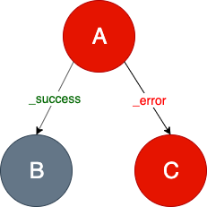

# Fragments Engine
Fragments Engine is a reactive asynchronous map-reduce implementation, enjoying the benefits of Reactive Extensions, 
that evaluates each Fragment independently using a `Task` definition. `Task` specifies a directed graph of Nodes, 
allowing to transform Fragment into the new one.

## How does it work
Any *Fragment* can define its processing path - a **Task** (which is a **directed graph** of **Nodes**).
A **Task** specifies the nodes through which Fragments will be routed by the Task Engine. 
Each Node may define possible *outgoing edges* - **Transitions**.

### Node
The node responsibility can be described as: 
> Graph node gets a fragment, processes it and responds with Transition. So a node is the function 
>`F -> (F', T)` where `F` is the Fragment, `F'` is a modified Fragment and `T` is the Transition.

The node definition is abstract. It allows to define simple processing nodes but also more complex 
structures such as a list of subgraphs.

There are two **node** types:
  - **simple nodes** that are simple operations that do some fragment modifications (called [Single Node](#single-node)),
  - **parallel complex nodes** that represent a list of subgraphs (called [Composite Node](#composite-node)).

### Single Node
The node represents a single operation that transforms one Fragment into another.

This operation can respond with **custom** transitions.
 
### Composite Node
This node may consist of other Composite Nodes or Single Nodes or a mix of both.
It enables parallel processing of independent nodes (e.g. calling two external data sources).
Composite Node may define only two transitions:
  - `_success` - the default one, means that operation ends without any exception
  - `_error` - when operation throws an exception
  
> Important note!
> Single Nodes inside the Composite Node may only modify the Fragment's payload and should not modify the Fragment's body.

### Transition
A directed graph consists of nodes and edges. Edges are called transitions. Transition is a simple text. 

The pre-defined transitions are:
- `_success` - the default one, indicates that operation completes successfully (no exception)
- `_error` - means that operation has throw an exception

There are two important rules to remember:
> If a node responds with *_success* transition, but the transition is not configured, then 
>processing is finished.

> If a node responds with *_error* transition, but the transition is not configured, then an 
>exception is returned.

> If a node responds with a not configured transition, the "Unsupported Transition" error occurs.

#### States

If a node does not declare a `_success` transition, processing is finished and Task Engine responds with
`SUCCESS` status.

Let's see the example above. *Node A* declares two transitions: `_success` and `_error`. 
If the transformation logic defined in *Node A* ends correctly, then the `_success` transition 
is set by default (unless *Node A* has set a custom transition) and *Node B* will continue processing.
If *Node B* ends correctly then Task Engine responds with the `SUCCESS` status. Otherwise, the `_error` 
transition is set, *Node B* does not declare it so the `FAILURE` state is returned.
If the transformation logic from *Node A* raises an exception, the `_error` transition is set and
*Node C* continues processing. *Node C* may end correctly, and then the entire processing is marked 
with the `SUCCESS` state.

The images below illustrates the above rules.

`SUCCESS` states:

* *Node A* and *Node B* ends correctly:

* *Node A* raises an exception, *Node B* ends correctly 

`FAILURE` states:

* *Node A* ends correctly and *Node B* raises exception:

* *Node A* and *Node C* raises exceptions:

A node can also declare its own exits (transitions) but then we need to configure them in a graph. 
Otherwise, if the custom transition is set but is not declared, then the `FAILURE` status is returned:

