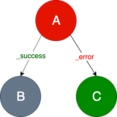

# Fragments Engine
Fragments Engine is a reactive asynchronous map-reduce implementation, enjoying the benefits of Reactive Extensions, 
that evaluates each Fragment independently using a `Task` definition. `Task` specifies a directed graph of Nodes, 
allowing to transform Fragment into the new one.

## How does it work
Any *Fragment* can define its processing path - a **Task** (which is a **directed graph** of **Nodes**).
A **Task** specifies the nodes through which Fragments will be routed by the Task Engine. 
Each Node may define possible *outgoing edges* - **Transitions**.

### Node
The node responsibility can be described as: 
> Graph node gets a fragment, processes it and responds with Transition. So a node is the function 
>`F -> (F', T)` where `F` is the Fragment, `F'` is a modified Fragment and `T` is the Transition.

The node definition is abstract. It allows to define simple processing nodes but also more complex 
structures such as a list of subgraphs.

There are two **node** types:
  - **single nodes** that are simple operations that do some fragments modifications (called [Single Node](#single-node)),
  - **parallel complex nodes** that are lists of subgraphs (called [Composite Node](#composite-node)).

### Single Node
A node represents a single operation that transforms one Fragment into another. The operation can 
produce multiple **custom** transitions that indicate various business decisions.

The example of this node is calling an authentication RESTful API. The node implements a communication 
logic and reacts to different API responses such as  HTTP 200/401/404 status codes. 
Each status code may represent various decisions such as a successful authentication, a user not 
found or even expired password. Those responses can be easily converted into custom transitions.
 
### Composite Node
A node defines a list of subgrahs to evaluate. It may consist of other Composite Nodes or Single Nodes 
or a mix of both. It enables parallel processing of independent nodes/subgraphs (e.g. calling two 
external independent data sources).

Composite Node may respond with only two default transitions:
  - `_success` - the default one, means that operation ends without any exception
  - `_error` - when operation throws an exception
  
> Important note!
> Single Nodes inside the Composite Node may only modify the Fragment's payload and should not modify 
>the Fragment's body.

### Transition
A directed graph consists of nodes and edges. Edges are called transitions. Transition is identified by a string. 

The pre-defined transitions are:
- `_success` - the default one, indicates that operation completes successfully (no exception)
- `_error` - means that operation has throw an exception

There are two important rules to remember:
> If a node responds with *_success* transition, but the `_success` transition is not configured, then 
>processing of the graph/subgraph is finished.

> If a node responds with *_error* transition, but the `_error` transition is not configured, then an 
>exception is returned.

> If a node responds with a not configured transition, the "Unsupported Transition" error occurs.

### Fragment's status
During fragment's processing, a fragment's status is calculated. Each node responds with a transition. 
Fragments Engine validates node responses and set one of the fragment's statuses:
- `unprocessed`
- `success`
- `failure`

The engine accepts a list of fragments to process and responds with a list of processed fragments 
containing fragment's data, the processing status and log. The decision what should happen when some 
fragment's statuses are `failure` is not taken in the engine.

Let's see the example below to understand when the fragment's status is `success` or `failure`.

> The *A* node declares two transitions: `_success` and `_error`. If the processing of the *A* node 
>finishes correctly, it responds with the `_success` transition and then the *B* node will continue 
>processing.

> If the `B` node completes successfully, it ends fragment processing with the `SUCCESS` status. 
> Otherwise, it returns the  `_error` transition and the fragment's status is `FAILURE`.

> If the processing of the `A` node throws an exception, then the `_error` transition is set, and 
>the `C` node continues processing. 

The images below illustrates the above rules.

`SUCCESS` statuses:

* `A` and `B` ends correctly

* `A` raises an exception (or responds with `_error`), then `B` ends correctly 

`FAILURE` status:

* `A` ends correctly, however `B` raises an exception (or responds with `_error`)

* `A` and `C` raise exceptions (or respond with `_error`)

* `A` node can also respond with its custom transitions. Then we have to configure them in a graph. 
Otherwise, if the `custom` transition is set but is not declared, then the `FAILURE` status is returned

