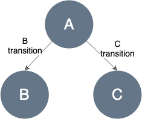
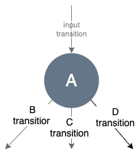
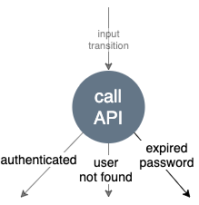
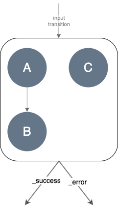
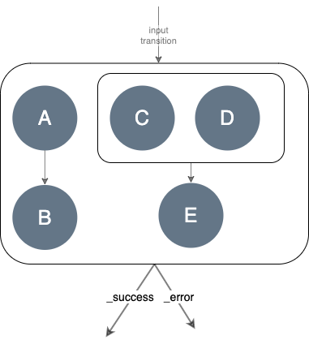

# Task API

## Task
Task decomposes business logic into lightweight dependent parts. Those parts are graph [nodes](#node) 
connected by [transitions](#transition). So a task is a directed graph of nodes. Nodes define an operation on the 
fragment (some business logic), whereas transitions draw business decisions.
This graph is acyclic and each of its nodes can be reached only from exactly one path (transition). 
These properties enable us to treat the Task as a tree structure.

The graph above depicts nodes, represented by circles (`A, B, C`), and transitions illustrated as 
arrows (`B transition`, `C transition`).

Tasks allow defining more complex structures such as a list of subtasks (subgraphs).

### Node
Node has a single input and declares zero-to-many outputs (transitions). Node outputs (transitions) 
indicate business decisions, whereas node logic can modify a fragment.

#### Single Node
A node represents a [fragment operation](https://github.com/Knotx/knotx-fragments/tree/master/api#fragment-operation) 
that performs business logic operations (see [Fragment Operation](https://github.com/Knotx/knotx-fragments/tree/master/api#fragment-operation) for more details).

The diagram below represents the single node (A) with three outputs: `B transition`, `C transition`, 
`D transition`.

The example of this node is calling an authentication RESTful API. The node implements a communication 
logic and reacts to different API responses such as  HTTP 200/401/404 status codes.

Each status code may represent various decisions such as a successful authentication, a user not 
found or even expired password.

#### Composite Node
Composite node defines a list of subgraphs to evaluate. It enables `parallel` processing of independent 
nodes/subgraphs (e.g. calling two external independent data sources).

A composite node can respond with only two transitions:
- `_success` - the default one, means that operation ends without any exception
- `_error` - when operation throws an exception

It may consist of list of subgraphs of single nodes:

or other composite nodes (or a mix of both).

The diagram above represents a composite node that consists of: 
- subgraph starting with `A` node
- subgraph that is also a composite node (that consists of two subgraphs starting with `C` and `D` nodes).
  
> Important note!
> Nodes inside the composite node may only append the Fragment's payload and should not modify 
> the Fragment's body. 
> It's because there is no guarantee which node finishes processing earlier and what will be the final body output

#### Node log
Every node can prepare some data that describes what happened during its processing. It is a JSON 
structure, called a node log. The node log syntax depends on node implementation.

### Transition
A directed graph consists of nodes and edges. Edges are called transitions. Transition is identified by a string. 

The pre-defined transitions are:
- `_success` - the default one, indicates that operation completes successfully (no exception)
- `_error` - means that operation has thrown an exception

There are three important rules to remember:
- If a node responds with *_success* transition, but the `_success` transition is not configured, then 
processing of the graph/subgraph is finished.
- If a node responds with *_error* transition, but the `_error` transition is not configured, then an 
exception is returned.
- If a node responds with a not configured transition, the "Unsupported Transition" error occurs.

Nodes can declare custom transitions. Custom transitions allow to react to non standard situations 
such as data sources timeouts, fallbacks etc. It is really easy, the action just needs to return any 
string as a transition name and then we can configure it in a graph.
