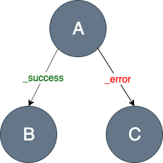
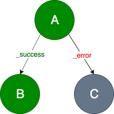
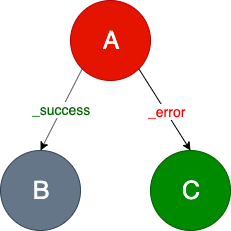
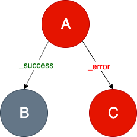

# Task Engine
Task Engine is a framework that transforms a business logic into a graph, that can be easily adjusted to the changes in the future. 

## How does it work
Task Engine accepts a list of fragments decorated with the incoming HTTP request data. Each 
[Fragment](https://github.com/Knotx/knotx-fragments/tree/master/api#fragment) defines its own 
business logic in the form of a [Task](https://github.com/Knotx/knotx-fragments/tree/master/task/api#task). The task is a graph (speaking strictly 
a [DAG - Directed Acyclic Graph](https://en.wikipedia.org/wiki/Directed_acyclic_graph_), composed of steps ([Nodes](https://github.com/Knotx/knotx-fragments/tree/master/task/api#node)) 
that are connected with business decisions ([Transitions](https://github.com/Knotx/knotx-fragments/tree/master/task/api#transition)).

It applies tasks to fragments asynchronously.

Finally, we get a list of modified fragments that contains [fragments' statuses](#fragments-status) 
and [processing logs](#fragments-log). 

## Fragment's status
During fragment's processing, a fragment's status is calculated. Each node responds with a transition. 
Fragments Engine validates node responses and set one of the fragment's statuses:
- `unprocessed`
- `success`
- `failure`

The engine accepts a list of fragments to process and responds with a list of processed fragments 
containing fragment's data, the processing status and log. The decision what should happen when some 
fragment's statuses are `failure` is not taken in the engine.

Let's see the example below to understand when the fragment's status is `success` or `failure`.

> The *A* node declares two transitions: `_success` and `_error`. If the processing of the *A* node 
>finishes correctly, it responds with the `_success` transition and then the *B* node will continue 
>processing.

> If the `B` node completes successfully, it ends fragment processing with the `SUCCESS` status. 
> Otherwise, it returns the  `_error` transition and the fragment's status is `FAILURE`.

> If the processing of the `A` node throws an exception, then the `_error` transition is set, and 
>the `C` node continues processing. 

The images below illustrates the above rules.

`SUCCESS` statuses:

* `A` and `B` ends correctly

* `A` raises an exception (or responds with `_error`), then `B` ends correctly 

`FAILURE` status:

* `A` ends correctly, however `B` raises an exception (or responds with `_error`)

* `A` and `C` raise exceptions (or respond with `_error`)

* `A` node can also respond with its custom transitions. Then we have to configure them in a graph. 
Otherwise, if the `custom` transition is set but is not declared, then the `FAILURE` status is returned

## Fragment's log
A fragment's log contains details about task evaluation. When node processing ends (or 
raises an exception), the engine appends the new [entry](https://github.com/Knotx/knotx-fragments/blob/master/engine/src/main/java/io/knotx/fragments/engine/EventLogEntry.java) 
in the fragment's log containing:
- task name
- node identifier
- node status
- [node log](#node-log)
- transition
- timestamp.

Node status is a simple text value managed by the engine. It resembles a fragment's status but is a 
bit more accurate (such as a `UNSUPPORTED_TRANSITION` value).

Let's see an example fragment's log. There is a fragment that defines a task named `taskName`. The 
task is a graph of two nodes: `A` and `B`.

The `A` node responds with the `_success` transition. Then the `B` node starts processing and responds 
with the `_succcess` transition. Finally, the fragment status is `SUCCESS` and the fragment's log contains:

| Task       | Node identifier | Node status | Transition | Node Log        |
|------------|-----------------|-------------|------------|-----------------|
| `taskName` | `A`             | SUCCESS     | `_success` | { A node log }  |
| `taskName` | `B`             | SUCCESS     | `_success` | { B node log }  |
