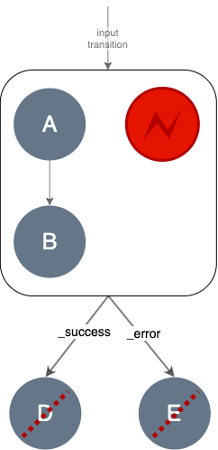
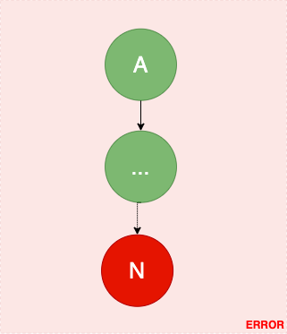

# Fragments/Task Engines
Fragments Engine (`io.knotx.fragments.task.engine.FragmentsEngine`) uses the [Map-Reduce pattern](https://pl.wikipedia.org/wiki/MapReduce)
to process [fragments](https://github.com/Knotx/knotx-fragments/tree/master/api#fragment) independently.

Then, it uses the Task Engine (`io.knotx.fragments.task.engine.TaskEngine`) to perform a
[task](https://github.com/Knotx/knotx-fragments/tree/master/task/api#task) logic on each fragment.

## How does it work
Fragments Engine accepts a list of fragments decorated with the incoming HTTP request. Then
it converts the list to [Reactive Stream](https://github.com/reactive-streams/reactive-streams-jvm)
and processes all its items independently, in parallel (`map`). Each time a fragment processing ends,
its' result is added to the final result. Finally, the engine returns a list of processed fragments with the
initial order.

Task engine processes a fragment based on logic defined in a [task](https://github.com/Knotx/knotx-fragments/tree/master/task/api#task).
Read more [here](#how-does-fragment-processing-work).

### How does fragment processing work?
Task engine updates a fragment (body and payload) based on the [task](https://github.com/Knotx/knotx-fragments/tree/master/task/api#task)
logic.

It starts a fragment processing with a root task node. When a node responds with a transition, it
continues until processing until there is no path defined (until it reaches a tree leaf). Then it
responds with a modified fragment, [processing status](#fragment-status) and [logs](#fragment-log).

Each node type follows different processing rules:
> When it is a [single node](https://github.com/Knotx/knotx-fragments/tree/master/task/api#single-node),
> then the engine runs a [fragment operation](https://github.com/Knotx/knotx-fragments/tree/master/api#fragment-operation)
> asynchronously and handles the response/errors. Read more [here](#single-node-processing).

> When it is a [composite node](https://github.com/Knotx/knotx-fragments/tree/master/task/api#composite-node),
> then all subtasks are processed independently, in parallel. Read more [here](#composite-node-processing). 

#### Single node processing
[Single node](ttps://github.com/Knotx/knotx-fragments/tree/master/task/api#composite-node) is a function,
so the following situations can happen:
- when a single node processing ends with the [success](https://github.com/Knotx/knotx-fragments/tree/master/task/api#success-transition) /
  [error](https://github.com/Knotx/knotx-fragments/tree/master/task/api#error-transition) /
  [custom](https://github.com/Knotx/knotx-fragments/tree/master/task/api#custom-transition) transition  
  
  
  
- when a single node throws a non-fatal exception, the task engine handles it and responds with
  the [error transition](https://github.com/Knotx/knotx-fragments/tree/master/task/api#error-transition);
  the processing follows the `_error` path 
  
- when a single node throws the fatal exception, the whole task ends with an error 
  

#### Composite node processing
[Composite node](https://github.com/Knotx/knotx-fragments/tree/master/task/api#composite-node) provides
a list of subgraphs to process (their root nodes). Task engine processes all subgraphs independently
(`map`), in parallel: 

Then it composes all asynchronous responses (`reduce`) with according rules:
- when a subgraph ends with the [success transition](https://github.com/Knotx/knotx-fragments/tree/master/task/api#success-transition),
  the result payload is merged into the final composite's result; however, the composite node still
  **waits** for the other subgraphs 
  
- when the last subgraph ends with the `success transition`, the composite node processing ends,
  and the processing follows the `_success` path 
  
- when a subgraph ends with a [custom transition](https://github.com/Knotx/knotx-fragments/tree/master/task/api#success-transition),
  this situation is interpreted as an error, the composite node processing ends and follows the `_error` path 
  
- when a subgraph ends with the [error transition](https://github.com/Knotx/knotx-fragments/tree/master/task/api#error-transition),
   the composite node processing ends and follows the `_error` path 
  
- when a subgraph thorws with an non-fatal exception, the composite node processing ends and follows the `_error` path 
  
- when a subgraph throws with a fatal exception, the composite node processing ends, an exception is propagated 
  

#### Fragment status
When a fragment does not specify any [task](https://github.com/Knotx/knotx-fragments/tree/master/task/api#task)
to execute it stays `unprocessed`. Otherwise, the task engine processes a fragment and finally sets one
of the following statuses:
- `success`
- `error`

A leaf node result determines a fragment status. A leaf node is a node that responds with a transition
for which we cannot determine any successor.

The following rules applies:
- when a leaf node responds with the [success transition](https://github.com/Knotx/knotx-fragments/tree/master/task/api#success-transition),
then a fragment status is `success` 

- when a leaf node responds with the [error transition](https://github.com/Knotx/knotx-fragments/tree/master/task/api#error-transition)
then a fragment status is `failure`.

- when a leaf node responds with a [custom transition](https://github.com/Knotx/knotx-fragments/tree/master/task/api#error-transition)
then a fragment status is `failure`.

#### Fragment log
A fragment's log contains details about task processing. When node processing ends (or
raises an exception), the engine appends the new [entry](https://github.com/Knotx/knotx-fragments/blob/master/engine/src/main/java/io/knotx/fragments/engine/EventLogEntry.java)
in the fragment's log containing:
- task name
- node identifier
- node status
- [node log](https://github.com/Knotx/knotx-fragments/tree/master/task/api##node-log)
- transition
- timestamp.

Node status is a simple text value managed by the engine. It resembles a fragment's status but is a
bit more accurate (such as a `UNSUPPORTED_TRANSITION` value).

Let's see an example fragment's log. There is a fragment that defines a task named `taskName`. The
task is a graph of two nodes: `A` and `B`.

The `A` node responds with the `_success` transition. Then the `B` node starts processing and responds
with the `_succcess` transition. Finally, the fragment status is `SUCCESS` and the fragment's log contains:

| Task       | Node identifier | Node status | Transition | Node Log        |
|------------|-----------------|-------------|------------|-----------------|
| `taskName` | `A`             | SUCCESS     | `_success` | { A node log }  |
| `taskName` | `B`             | SUCCESS     | `_success` | { B node log }  |
