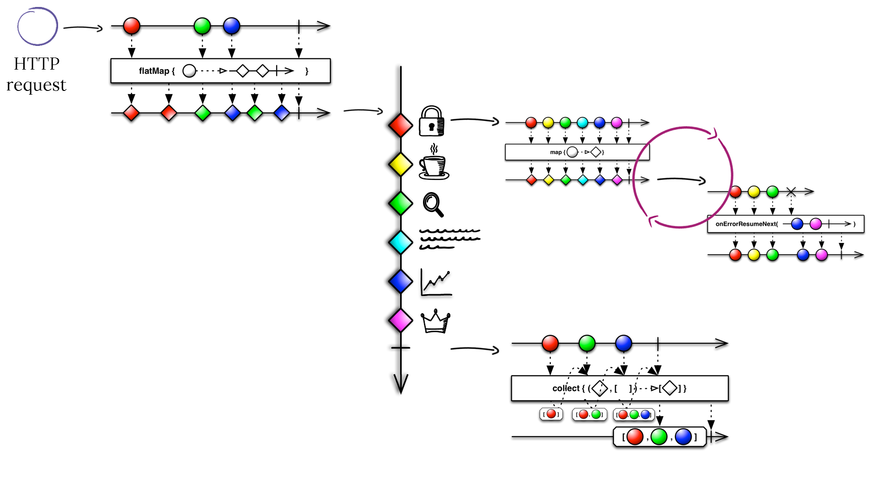

# Fragments Handler
It is a [**Handler**](https://github.com/Knotx/knotx-server-http/tree/master/api#routing-handlers)
that [evaluates Fragments](https://github.com/Knotx/knotx-fragments#evaluate-fragments). It is 
a standard [HTTP Server routing handler](https://github.com/Knotx/knotx-server-http/blob/master/README.md#routing-handler).

## How does it work
Fragments handler evaluates all fragments independently in a map-reduce fashion. It delegates fragment 
processing to the [Fragment Engine](https://github.com/Knotx/knotx-fragments/tree/master/engine).  
The engine checks if the fragment requires processing and if it does then fragment processing starts.
Order and transitions between each of these executions is represented as a directed acyclic graph 
(DAG). A single graph is called a `Task`.

The diagram below depicts the map-reduce logic using [Marble Diagrams for Reactive Streams](https://medium.com/@jshvarts/read-marble-diagrams-like-a-pro-3d72934d3ef5):

Let's assume that Knot.x gets HTTP requests for data coming from many different sources. Dots at the 
`flatMap` diagram represents incoming requests. For simplicity assume that each request maps to a 
single fragment to process. Then each fragment is evaluated in isolation, not waiting for others. 
A fragment defines a task (graph) describing how to fetch the required data. The `map` and 
`onErrorResumeNext` diagrams represent a graph processing. When the fragment processing finishes, the 
modified fragment is returned. Please note that an HTTP request can be mapped to many fragments. In 
such a case the `collect` diagram represents fragments joining.

Read more about the benefits [here](http://knotx.io/blog/configurable-integrations/).

## How to configure
For all configuration fields and their defaults consult [FragmentsHandlerOptions](https://github.com/Knotx/knotx-fragments/blob/master/handler/core/docs/asciidoc/dataobjects.adoc#fragmentshandleroptions).

In general:
- it gets fragments from a request, collects only those that require processing checking fragment's 
configuration `taskNameKey` key
- it finds [task](https://github.com/Knotx/knotx-fragments/tree/master/engine#task) factory 
from `taskFactories` that can create a task
- task factory constructs a task (DAG - directed acyclic graph)
- [Fragment Engine](https://github.com/Knotx/knotx-fragments/tree/master/engine) continues 
further fragment's processing
- when fragments processing ends it notifies all [consumers](#fragment-execution-log-consumer) about 
processed fragments, consumers are registered with factories defined in `consumerFactories`

Detailed description of each configuration option is described in the next subsection.

### TaskFactoryOptions
The `taskFactories` is an array of [TaskFactoryOptions](https://github.com/Knotx/knotx-fragments/blob/feature/%2349-node-factories-with-common-configs/handler/core/docs/asciidoc/dataobjects.adoc#taskfactoryoptions) 
that contains configs for registered [task factories](https://github.com/Knotx/knotx-fragments/blob/master/handler/core/src/main/java/io/knotx/fragments/task/TaskFactory.java) 
implementations.

All task factory implementations are registered using a simple service-provider loading facility - 
[Service Loader](https://docs.oracle.com/javase/8/docs/api/java/util/ServiceLoader.html).

## Fragment Event
Fragments Handler takes fragments from the request context and wraps them into fragment events. 
Fragment event contains a fragment, task status and task log.

### Fragment Execution Log Consumer
Fragment Execution Log Consumer receives fragment execution data when task evaluation ends. It can share this 
information with some external tools.
By default it receives data only if given fragment ends with success. 
This can be changed by setting either `allowInvalidFragmentsHeader` or `allowInvalidFragmentsParam` option and
providing HTTP header or query parameter in the request respectively.

You can read more about consumers [here](https://github.com/Knotx/knotx-fragments/tree/master/handler/consumer).