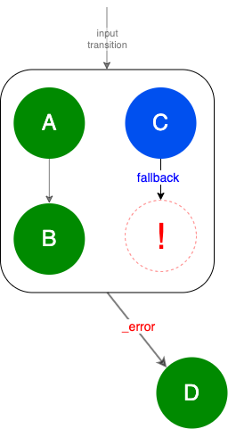

# Fragment Execution Log Consumer
[Fragment Execution Log Consumer](https://github.com/Knotx/knotx-fragments/blob/master/handler/consumer/api/src/java/io/knotx/fragments/handler/consumer/api/FragmentExecutionLogConsumer.java) 
listens for fragment processing operations results. When a fragment operation ends, task execution 
data is exposed to consumers via [Fragment execution log](#what-is-the-execution-log).

## How to configure
You can choose and configure one of the pre-defined consumers:
- [Fragment HTML Body Writer](https://github.com/Knotx/knotx-fragments/blob/master/handler/consumer/html)
- [JSON Writer](https://github.com/Knotx/knotx-fragments/blob/master/handler/consumer/json)

or implement your custom one. Check the [Fragments Handler](https://github.com/Knotx/knotx-fragments/tree/master/handler#how-to-configure) 
documentation for configuration details.

## What is the execution log?
[Fragment execution log](https://github.com/Knotx/knotx-fragments/blob/master/handler/consumer/api/docs/asciidoc/dataobjects.adoc#fragmentexecutionlog)
is a JSON that contains both [fragment](https://github.com/Knotx/knotx-fragments/blob/master/api/docs/asciidoc/dataobjects.adoc#fragment) 
data and [graph node execution log](https://github.com/Knotx/knotx-fragments/blob/master/handler/consumer/api/docs/asciidoc/dataobjects.adoc#graphnodeexecutionlog).
  
The [graph node execution log](#graph-node-execution-log) contains data about the processing of the 
[Task](https://github.com/Knotx/knotx-fragments/tree/master/engine#task)'s root node and allows you to 
traverse the entire graph.

### Graph Node Execution log
[Graph node execution log](https://github.com/Knotx/knotx-fragments/blob/master/handler/consumer/api/docs/asciidoc/dataobjects.adoc#graphnodeexecutionlog) 
represents a root node execution data. It combines knowledge from sources:
- [Task definition](https://github.com/Knotx/knotx-fragments/tree/master/engine#task)
- [Task metadata](https://github.com/Knotx/knotx-fragments/blob/master/handler/api/src/main/java/io/knotx/fragments/handler/api/metadata/TaskMetadata.java)
- [Fragment's log](https://github.com/Knotx/knotx-fragments/tree/master/engine#fragments-log)

The main difference between the Task definition and the graph node execution log is presence of [missing nodes](#missing-nodes).

#### Missing nodes
When graph or subgraph processing ends with a [transition](https://github.com/Knotx/knotx-fragments/tree/master/engine#transition) 
other than `_success` then a missing node is added. 

See the scenarios below:
- [single node](https://github.com/Knotx/knotx-fragments/tree/master/engine#single-node) responds 
  with the `_error` transition that is not configured

  

- [single node](https://github.com/Knotx/knotx-fragments/tree/master/engine#single-node) responds 
  with the custom transition that is not configured
  
  
  
- one of the subgraphs in the [composite node](https://github.com/Knotx/knotx-fragments/tree/master/engine#composite-node) 
  ends with `_error` transition what indicates that the whole composite node ends with `_error` 
  transition (**not declared in the task**)

  

- one of the subgraphs in the [composite node](https://github.com/Knotx/knotx-fragments/tree/master/engine#composite-node) 
  ends with `_error` transition what indicates that the whole composite node ends with `_error` 
  transition (**declared in the task**) 

  

- one of the subgraphs in the [composite node](https://github.com/Knotx/knotx-fragments/tree/master/engine#composite-node) 
  ends with the custom `fallback` transition what indicates that the whole composite ends with `_error` 
  transition (**not declared in the task**)

  

- one of the subgraphs in the [composite node](https://github.com/Knotx/knotx-fragments/tree/master/engine#composite-node) 
  ends with the custom `fallback` transition what indicates that the whole composite ends with `_error` 
  transition (**declared in the task**)

  
  
Green nodes end with `_success` transition, red nodes with `_error` and blue nodes with custom. Nodes 
with exclamation mark are missing nodes. 
